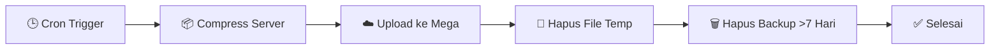

<div align="center">

# 🎮 NexSora Network - Auto Backup System

**Backup otomatis harian untuk server Minecraft, upload ke Mega.nz, auto-cleanup backup lama**


</div>

---

## 📋 Deskripsi

Script ini melakukan backup otomatis harian untuk server Minecraft, meng-compress data server, mengupload hasilnya ke **Mega.nz**, dan menghapus backup lama secara otomatis agar penyimpanan tidak penuh.

```
┌──────────────────────────────────────────┐
│ NEXSORA BACKUP                            │
├──────────────────────────────────────────┤
│ Mulai   : 2026-09-09 03:00:00 WIB         │
│ Server  : /var/lib/pterodactyl/volumes/.. │
└──────────────────────────────────────────┘
>> Compressing, mohon tunggu...
>> [####################] 100%
>> Uploading ke Mega...
┌──────────────────────────────────────────┐
│ RINGKASAN BACKUP                          │
├──────────────────────────────────────────┤
│ Compress   : OK                           │
│ Ukuran     : 1.9G                         │
│ Upload     : OK                           │
│ Cleanup    : Backup >7 hari dihapus       │
├──────────────────────────────────────────┤
│ Selesai    : 2026-09-09 03:07:12 WIB      │
└──────────────────────────────────────────┘
```

## 📁 Struktur File

| File | Lokasi | Keterangan |
|---|---|---|
| 📜 Script backup | `/root/Backup-server/backup-nexsora.js` | Script utama (Node.js) |
| 📄 Log backup | `/root/Backup-server/backup.log` | Riwayat proses backup |
| 🔑 Config rclone | `/root/.config/rclone/rclone.conf` | Kredensial Mega |
| ⚙️ Config PM2 | `/root/Backup-server/backup-ecosystem.config.js` | Jadwal cron |
| 🗂️ Folder server | `/var/lib/pterodactyl/volumes/<UUID>` | Data server Minecraft |
| ☁️ Folder tujuan | `mega:NexSoraBackups` | Tujuan upload backup |

## ⚙️ Cara Kerja



1. Menghitung ukuran folder server
2. Compress seluruh isi folder server menjadi `.tar.gz`
3. Upload file ke Mega.nz (folder `NexSoraBackups`)
4. Hapus file backup sementara di VPS
5. Hapus backup di Mega yang berumur lebih dari 7 hari
6. Tampilkan ringkasan hasil backup

## 🚀 Instalasi

### 1️⃣ Clone repository
```bash
git clone https://github.com/carlihost/Backup-server.git
cd Backup-server
```

### 2️⃣ Install dependencies
```bash
apt update && apt install -y rclone tar
curl -fsSL https://deb.nodesource.com/setup_20.x | sudo bash -
apt install -y nodejs
node -v
```

### 3️⃣ Setup rclone untuk Mega.nz

Jalankan:
```bash
rclone config
```

Ikuti prompt secara berurutan (isi sesuai urutan ini):
```
n/s/q>                      -> n
name>                       -> mega
Storage>                    -> (cari & pilih nomor untuk Mega)
user>                       -> email akun Mega kamu
y/g>                        -> y
password:                   -> (masukkan password, konfirmasi ulang)
2fa>                        -> (Enter jika tidak pakai 2FA)
Edit advanced config?       -> n
Keep this "mega" remote?    -> y
e/n/d/r/c/s/q>              -> q
```

**Test koneksi:**
```bash
rclone lsd mega:
```

**Buat folder tujuan backup:**
```bash
rclone mkdir mega:NexSoraBackups
```

**Test upload:**
```bash
echo "test backup" > /root/test.txt
rclone copy /root/test.txt mega:NexSoraBackups/
rclone ls mega:NexSoraBackups/
```
Jika muncul `test.txt` di hasil `rclone ls`, koneksi ke Mega sudah berhasil.

> [!TIP]
> Belum punya akun Mega? Daftar gratis (kuota 20GB) di [mega.nz](https://mega.nz) — bisa langsung dari browser HP, tidak perlu OAuth atau device tambahan.

### 4️⃣ Sesuaikan konfigurasi script
File `backup-nexsora.js` sudah tersedia dari hasil clone. Edit variabel `SERVER_DIR` agar sesuai dengan path folder server kamu:
```bash
nano /root/Backup-server/backup-nexsora.js
```

### 5️⃣ Test manual
```bash
node /root/Backup-server/backup-nexsora.js
```

## ⏰ Menjalankan Otomatis dengan PM2

### Install PM2 (jika belum ada)
```bash
npm install -g pm2
```

### File konfigurasi PM2
File `backup-ecosystem.config.js` juga sudah tersedia dari hasil clone (isi sudah sesuai):
```javascript
module.exports = {
  apps: [{
    name: "nexsora-backup",
    script: "/root/Backup-server/backup-nexsora.js",
    interpreter: "node",
    cron_restart: "0 20 * * *",
    autorestart: false,
    watch: false
  }]
}
```
> 💡 Jadwal `0 20 * * *` berarti jam 20:00 UTC = 03:00 WIB (asumsi VPS pakai timezone UTC). Cek timezone VPS dengan `timedatectl`.

### Jalankan
```bash
pm2 start /root/Backup-server/backup-ecosystem.config.js
pm2 save
pm2 startup
```

## 🛠️ Perintah Penting

```bash
# Jalankan backup manual
node /root/Backup-server/backup-nexsora.js

# Lihat log backup
cat /root/Backup-server/backup.log

# Lihat log via PM2
pm2 logs nexsora-backup

# Cek status proses PM2
pm2 list

# Restart setelah edit script
pm2 restart nexsora-backup

# Lihat isi folder backup di Mega
rclone ls mega:NexSoraBackups/

# Lihat daftar folder remote
rclone lsd mega:
```

## 🗑️ Mengubah Retensi Backup

Edit `/root/Backup-server/backup-nexsora.js`, cari baris:
```javascript
const RETENTION_DAYS = '7d';
```
Ganti `7d` sesuai kebutuhan:
```
1d  = simpan 1 hari terakhir (paling hemat storage)
3d  = simpan 3 hari terakhir (seimbang)
5d  = simpan 5 hari terakhir (lebih aman)
7d  = simpan 7 hari terakhir (default, perlu ~13GB dari kuota 20GB)
```

Setelah edit, jalankan:
```bash
pm2 restart nexsora-backup
```

## ⚠️ Catatan Penting

> [!WARNING]
> Akun Mega gratis memiliki kuota **20GB** — pastikan `ukuran backup × jumlah hari retensi` tidak melebihi kuota.

> [!NOTE]
> Proses backup **tidak memakan kuota data HP** — semua proses berjalan di VPS.

> [!TIP]
> Warning `file changed as we read it` saat compress bersifat normal (server menulis file world secara live).

> [!CAUTION]
> **Jangan commit kredensial** (email/password Mega, service account, dll) ke repository ini.

## 🐛 Troubleshooting

<details>
<summary><b>Backup tidak jalan otomatis</b></summary>

Cek `pm2 list`, pastikan proses `nexsora-backup` terdaftar. Pastikan `pm2 save` dan `pm2 startup` sudah dijalankan.
</details>

<details>
<summary><b>Ingin melihat progress saat compress</b></summary>

Progress bar ditampilkan sekali di akhir proses compress untuk menghindari log yang penuh.
</details>

<details>
<summary><b>Error <code>storageQuotaExceeded</code> di Google Drive</b></summary>

Ini terjadi jika menggunakan Google Service Account tanpa Shared Drive. Solusi: gunakan Mega.nz seperti yang diimplementasikan di script ini.
</details>

---

<div align="center">

**Dibuat untuk NexSora Network** • [nexsora.biz.id](https://nexsora.biz.id)

⭐ Star repo ini kalau bermanfaat!

</div>
